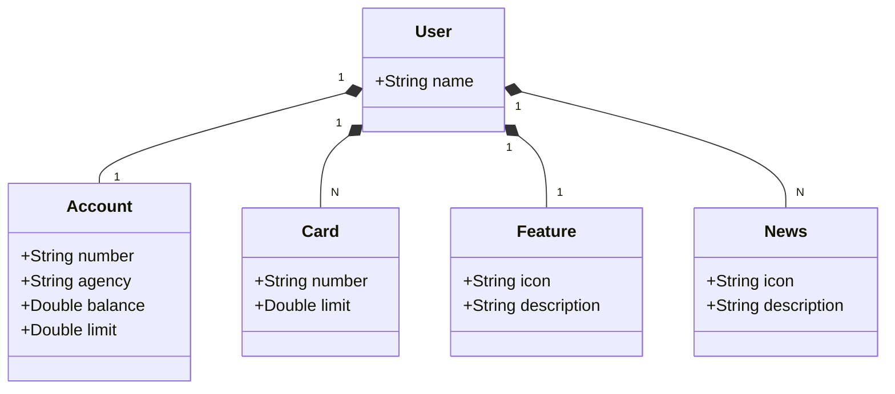

# Santander Dev Week 2025 - API REST

Uma API RESTful desenvolvida em Java 21 para a Santander Dev Week 2025, proporcionando uma solução completa para gerenciamento de usuários, contas, cartões e funcionalidades bancárias.

## 🚀 Tecnologias Utilizadas

- **Java 21** - Linguagem de programação
- **Spring Boot 3** - Framework principal
- **Spring Data JPA** - Persistência de dados
- **H2 Database** - Banco de dados em memória (desenvolvimento)
- **OpenAPI/Swagger** - Documentação da API
- **Railway** - Plataforma de deploy
- **IntelliJ IDEA** - IDE de desenvolvimento
- **Gradle** - Gerenciamento de dependências

## 📋 Pré-requisitos

- Java 21 ou superior
- IntelliJ IDEA (recomendado) ou outra IDE Java
- Conta no Railway para deploy
- Git para controle de versão

## 🔧 Instalação e Configuração

1. **Clone o repositório:**
```bash
git clone https://github.com/seu-usuario/santander-dev-week-2025.git
cd santander-dev-week-2025
```

2. **Configure o ambiente:**
- Importe o projeto no IntelliJ IDEA como projeto Gradle
- Certifique-se de que o Java 21 está configurado no projeto

3. **Execute a aplicação:**
```bash
./gradlew bootRun
```

## 🏗️ Estrutura do Projeto

```
santander-dev-week-2025/
├── src/main/java/me/dio/
│   ├── controller/          # Controladores REST
│   ├── domain/model/        # Entidades do domínio
│   ├── repository/          # Interfaces de repositório
│   ├── service/            # Lógica de negócio
│   └── dto/                # Objetos de transferência de dados
├── src/main/resources/
│   ├── application-dev.yml  # Configurações desenvolvimento
│   └── application-prod.yml # Configurações produção
└── build.gradle            # Configurações do Gradle
```

## 📊 Diagrama de Classes

## Diagrama de Classes




## 🎯 Endpoints da API

### GET /api/users/{id}
Retorna os dados do usuário com o ID especificado.

**Resposta de Exemplo:**
```json
{
  "name": "AnaPaula",
  "account": {
    "number": "10000000-0",
    "agency": "0000",
    "balance": 1324.64,
    "limit": 1000
  },
  "features": [
    {
      "icon": "URL",
      "description": "Descrição da feature"
    }
  ],
  "card": {
    "number": "xxxx xxxx xxxx 0000",
    "limit": 1000
  },
  "news": [
    {
      "icon": "URL",
      "description": "Descrição de Novidades"
    }
  ]
}
```

### POST /api/users
Cria um novo usuário.

### PUT /api/users/{id}
Atualiza um usuário existente.

### DELETE /api/users/{id}
Remove um usuário.

## 🤝 Contribuição

1. Fork o projeto
2. Crie uma branch para sua feature (`git checkout -b feature/AmazingFeature`)
3. Commit suas mudanças (`git commit -m 'Add some AmazingFeature'`)
4. Push para a branch (`git push origin feature/AmazingFeature`)
5. Abra um Pull Request

## 📄 Licença

Este projeto está sob a licença MIT. Veja o arquivo [LICENSE](LICENSE) para detalhes.

## 👥 Autores

- **Thiago Carvalho Ferrer** - Full Stack Development

## 🙏 Agradecimentos

- Santander Brasil pela oportunidade
- Equipe DIO pela mentoria
- Comunidade Java e Spring